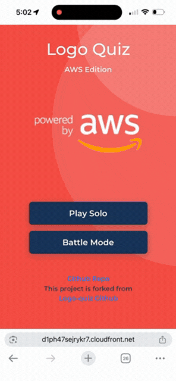

# Logo Quiz AWS Edition

An AWS services version of Logo Quiz. Test your knowledge of AWS service logos!

This is forked from Logo-quiz github. Thanks!

## Features

### Solo Mode
- Guess AWS service logos at your own pace
- Progress through multiple levels
- Track your completion progress

### Battle Mode (Multiplayer)
- Create or join game rooms with friends
- Real-time competitive logo guessing
- Live leaderboard during gameplay
- Configurable game settings (time limit, number of logos)
- Score penalties for wrong answers
- See answers revealed when other players solve



**Note:** This project is still highly experimental. It was created as a personal introduction to React, Redux and NestJS. You may find some bad practices in the code.

Report bugs or feature requests by opening an [issue](https://github.com/hspoon-aws/logo-quiz-aws/issues).

## Technical Design

### Architecture Overview

```
┌─────────────────────────────────────────────────────────────────┐
│                         Frontend                                 │
│  ┌─────────────┐  ┌─────────────┐  ┌─────────────────────────┐  │
│  │  React SPA  │  │    Redux    │  │   Socket.io Client      │  │
│  │   (Vite)    │──│    Store    │──│  (Real-time events)     │  │
│  └─────────────┘  └─────────────┘  └─────────────────────────┘  │
└─────────────────────────────────────────────────────────────────┘
                              │
                    HTTP REST │ WebSocket
                              ▼
┌─────────────────────────────────────────────────────────────────┐
│                          Backend                                 │
│  ┌─────────────┐  ┌─────────────┐  ┌─────────────────────────┐  │
│  │   NestJS    │  │   Game      │  │   Socket.io Server      │  │
│  │    REST     │  │  Gateway    │──│  (WebSocket handlers)   │  │
│  └─────────────┘  └─────────────┘  └─────────────────────────┘  │
└─────────────────────────────────────────────────────────────────┘
                              │
                              ▼
┌─────────────────────────────────────────────────────────────────┐
│                        DynamoDB                                  │
│  ┌─────────────┐  ┌─────────────┐  ┌─────────────────────────┐  │
│  │    Users    │  │   Levels    │  │         Logos           │  │
│  └─────────────┘  └─────────────┘  └─────────────────────────┘  │
└─────────────────────────────────────────────────────────────────┘
```

### Tech Stack

| Layer | Technology |
|-------|------------|
| Frontend | React 18, TypeScript, Redux, Vite, SCSS |
| Backend | NestJS 10, TypeScript, Passport JWT |
| Real-time (Dev) | Socket.io 4.7 (WebSocket) |
| Real-time (Prod) | API Gateway WebSocket + Lambda |
| Database | DynamoDB (AWS SDK v3) |
| Auth | Firebase Authentication |
| Container | Docker/Finch |

### WebSocket Dual-Mode Architecture

The frontend `SocketService` (`apps/logo-quiz/src/shared/services/socket.service.ts`) supports two modes:

| Mode | When | Connection | Backend |
|------|------|------------|---------|
| **Development** | `webSocketUrl` not set | Socket.io | NestJS GameGateway |
| **Production** | `webSocketUrl` set | Native WebSocket | API Gateway + Lambda |

This allows local development with Socket.io's rich features while production uses serverless WebSocket API for cost efficiency and scalability.

### Monorepo Structure

```
logo-quiz-aws/
├── apps/
│   ├── api/                    # NestJS backend
│   │   └── src/
│   │       ├── app/
│   │       │   ├── auth/       # Authentication module
│   │       │   ├── game/       # Battle mode WebSocket gateway
│   │       │   ├── level/      # Levels REST API
│   │       │   ├── logo/       # Logos REST API
│   │       │   └── user/       # Users REST API
│   │       └── shared/
│   │           ├── schema/     # DynamoDB entity definitions
│   │           └── service/    # Shared services (incl. DynamoDBService)
│   │
│   └── logo-quiz/              # React frontend
│       └── src/
│           ├── app/
│           │   └── views/
│           │       ├── Battle/         # Battle mode components
│           │       │   ├── BattleMenu/
│           │       │   ├── CreateRoom/
│           │       │   ├── JoinRoom/
│           │       │   ├── GameLobby/
│           │       │   ├── BattleGame/
│           │       │   └── Scoreboard/
│           │       ├── LevelList/      # Solo mode level selection
│           │       ├── LogoList/       # Logo grid view
│           │       └── LogoVerify/     # Solo mode guessing
│           ├── shared/
│           │   └── services/
│           │       └── socket.service.ts
│           └── store/
│               ├── gameRoom/   # Battle mode state
│               ├── level/      # Single level state
│               ├── levels/     # All levels state
│               └── logo/       # Current logo state
│
└── libs/
    └── models/                 # Shared TypeScript interfaces/DTOs
```

### Battle Mode Flow

```
┌──────────┐     ┌──────────┐     ┌──────────┐     ┌──────────┐
│  Create  │────▶│  Lobby   │────▶│   Game   │────▶│Scoreboard│
│   Room   │     │ (Ready)  │     │ (Play)   │     │ (Results)│
└──────────┘     └──────────┘     └──────────┘     └──────────┘
      │                │                │                │
      ▼                ▼                ▼                ▼
┌──────────────────────────────────────────────────────────────┐
│                    WebSocket Events                           │
├──────────────────────────────────────────────────────────────┤
│ room:create    │ room:ready     │ game:logo      │ game:end  │
│ room:join      │ room:state     │ game:answer    │           │
│ room:leave     │ game:start     │ game:score     │           │
│                │                │ game:timer     │           │
│                │                │ game:revealed  │           │
└──────────────────────────────────────────────────────────────┘
```

### WebSocket Events

#### Client → Server
| Event | Description |
|-------|-------------|
| `room:create` | Create a new game room |
| `room:join` | Join existing room by code |
| `room:leave` | Leave current room |
| `room:ready` | Toggle ready status |
| `game:start` | Host starts the game |
| `game:answer` | Submit answer guess |

#### Server → Client
| Event | Description | Payload |
|-------|-------------|---------|
| `room:created` | Room created confirmation | `{ roomCode, state }` |
| `room:joined` | Successfully joined room | `{ roomCode, state }` |
| `room:state` | Room state update | `{ players, status, settings }` |
| `room:error` | Error message | `{ message }` |
| `room:cancelled` | Room was cancelled | `{ reason }` |
| `game:started` | Game has begun | `{ totalLogos, timeLimit }` |
| `game:logo` | New logo to guess | `{ logoId, obfuscatedImageUrl, letters, obfuscatedName, logoIndex, totalLogos }` |
| `game:answer-result` | Answer validation result | `{ correct, points, totalScore, correctAnswer? }` |
| `game:score-update` | Leaderboard update | `{ leaderboard: [{ displayName, score, correctAnswers }] }` |
| `game:answer-revealed` | Someone solved - show answer | `{ answer, solvedBy, logoIndex }` |
| `game:end` | Game finished with final scores | `{ rankings: [{ rank, displayName, score, correctAnswers }], totalLogos, gameTime }` |

### Scoring System

| Action | Points |
|--------|--------|
| Correct answer | +100 base + up to +50 speed bonus |
| Wrong answer | -100 |
| Minimum score | 0 |

Speed bonus calculation: `bonus = floor(50 * (1 - timeTaken / totalGameTime))`
- Answer immediately: +150 points (100 + 50)
- Answer at end: +100 points (100 + 0)

### Answer Validation

- Case-insensitive comparison
- Space-insensitive (e.g., "GROUNDSTATION" matches "Ground Station")
- Supports multi-word answers with visual spaces in UI

## Contribute

You'll need Docker or Finch to run the local DynamoDB instance. Then run the following commands.

1. Start DynamoDB local
```bash
npm run start:dynamodb
# Or manually: finch run -d -p 8000:8000 --name dynamodb-local amazon/dynamodb-local
# To stop: npm run stop:dynamodb
```

2. Seed the database (first time only)
```bash
npm run seed:dynamodb
```

3. Update AWS icons (optional - downloads latest from AWS)
```bash
npm run update:icons
```

4. Run backend
```bash
npm run start:api
```
The backend will run on port 3333

5. Run frontend
```bash
npm run start:frontend
```
The frontend will run on port 4200

### AWS Icons

The logo images are sourced from the official [AWS Architecture Icons](https://aws.amazon.com/architecture/icons/) package. To update to the latest icons:

```bash
npm run update:icons           # Check and download if newer version available
npm run update:icons:force     # Force re-download
npm run refresh:icons          # Update icons AND reseed the database
```

## Production Deployment

The application is deployed on AWS with the following architecture:

```
CloudFront (CDN) ──────> S3 Bucket (React SPA)

App Runner (API) ──────> DynamoDB (Users, Levels, Logos, UserState)

WebSocket API Gateway ─> Lambda ─> DynamoDB (GameRooms, GameSessions)
```

### Live URLs

| Service | URL |
|---------|-----|
| Frontend | https://d1ph47sejrykr7.cloudfront.net |
| REST API | https://hxhjbyvimw.us-east-1.awsapprunner.com/api |
| WebSocket | wss://ehv67k1and.execute-api.us-east-1.amazonaws.com/prod |

### Deployment Commands

```bash
# Deploy infrastructure (first time)
cd infra
npm install
npx cdk bootstrap
npm run deploy

# Deploy API changes
./scripts/deploy-api.sh

# Deploy frontend changes
./scripts/deploy-frontend.sh

# Seed production database
./scripts/seed-production.sh
```

See `infra/README.md` for detailed deployment documentation.

## AWS Well-Architected Review

Assessment of Logo Quiz AWS against the [AWS Well-Architected Framework](https://aws.amazon.com/architecture/well-architected/).

### Summary

| Pillar | Status | Key Strengths | Areas for Improvement |
|--------|--------|---------------|----------------------|
| **Security** | ⚠️ Medium | Secrets Manager, IAM least-privilege, S3 OAI | Input validation, WebSocket auth, rate limiting |
| **Reliability** | ⚠️ Medium | Health checks, DynamoDB PITR, TTL cleanup | Retry logic, enhanced health checks, multi-AZ |
| **Performance** | ✅ Good | CloudFront CDN, DynamoDB GSIs, pay-per-request | Response caching, query optimization |
| **Cost Optimization** | ✅ Good | Pay-per-request, minimal compute, TTL cleanup | Log retention policies, scale-to-zero |
| **Operational Excellence** | ⚠️ Medium | CDK IaC, modular stacks, deployment scripts | CI/CD pipeline, monitoring, alerting |

### Security Pillar

**Strengths:**
- AWS Secrets Manager for API secrets (APP_SALT, APP_SESSION_SECRET)
- Granular IAM roles with least-privilege access for App Runner, Lambda, DynamoDB
- S3 bucket with CloudFront Origin Access Identity (OAI)
- JWT-based authentication with Passport.js
- HMAC-SHA256 password hashing with salt

**Recommendations:**
- Add input validation (class-validator) for all API endpoints
- Implement WebSocket authentication on $connect route
- Add rate limiting on auth endpoints and WebSocket connections
- Move Firebase config to environment variables or Secrets Manager
- Add security headers (HSTS, CSP, X-Frame-Options)

### Reliability Pillar

**Strengths:**
- App Runner health checks (`/api/health`, 10s interval)
- DynamoDB Point-in-Time Recovery (PITR) enabled
- TTL on GameRooms/GameSessions for automatic cleanup
- Global exception filter for centralized error handling

**Recommendations:**
- Enhance health check to verify database connectivity
- Implement retry logic with exponential backoff for DynamoDB operations
- Enable PITR on all DynamoDB tables
- Add CloudWatch Logs with retention policies
- Consider multi-AZ deployment for production

### Performance Pillar

**Strengths:**
- CloudFront CDN with CACHING_OPTIMIZED policy
- Efficient DynamoDB schema with proper GSIs
- Pay-per-request billing auto-scales with demand
- Multi-stage Docker build with minimal production image

**Recommendations:**
- Add response caching (Redis/ElastiCache) for logos/levels
- Optimize DynamoDB scans with GSI for connection lookups
- Enable response compression (gzip/brotli)
- Use projection expressions to return only needed fields

### Cost Optimization Pillar

**Strengths:**
- DynamoDB on-demand billing (pay-per-request)
- App Runner 0.25 vCPU / 0.5 GB (minimal tier)
- CloudFront PriceClass 100 (US/Canada/Europe only)
- ECR lifecycle rules (keeps only 5 images)
- TTL cleanup prevents storage bloat

**Recommendations:**
- Set CloudWatch Logs retention (30-90 days)
- Configure App Runner scale-to-zero for idle periods
- Set up AWS Budgets alerts
- Evaluate provisioned capacity if traffic becomes predictable

### Operational Excellence Pillar

**Strengths:**
- AWS CDK for Infrastructure as Code
- Modular stack design (Database, API, Frontend, WebSocket)
- Deployment automation scripts
- Winston structured logging framework

**Recommendations:**
- Implement CI/CD pipeline (GitHub Actions, CodePipeline)
- Add CloudWatch dashboards and alarms
- Enable AWS X-Ray for distributed tracing
- Create runbook documentation for incident response
- Add version endpoint for deployment tracking

### Priority Actions

1. **High**: Add input validation and WebSocket authentication
2. **High**: Implement CI/CD pipeline for automated deployments
3. **Medium**: Set up CloudWatch monitoring and alerting
4. **Medium**: Enhance health checks with database connectivity verification
5. **Low**: Add response caching for frequently accessed data

## Resources

1. Obfuscate & Randomize: https://repl.it/@caroso1222/obfuscate-randomize
2. Mock credentials. Email: quiz@gmail.com. Pwd: testing
